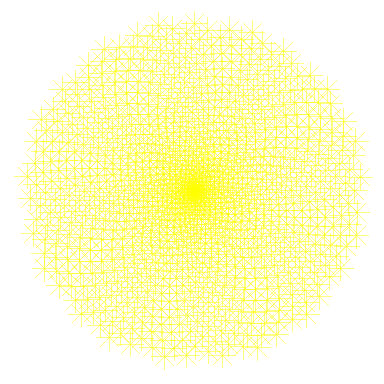

Desenhando Flores Usando Matemática
================

## 1. Padrões na natureza

<p>

</p>
<p>
<em> “O cientista não estuda a natureza porque ela é útil. Ele estuda
porque tem prazer nisso, e tem prazer porque é bonito.” (Henri
Poincaré)</em>
</p>
<p>
Há muitos exemplos de <em> fatos naturais </em> que pode ser descritos
em termos matemáticos. Bons exemplos são as formas de flocos de neve, a
geometria fractal do brócolis romanesco ou como a auto-semelhança rege o
crescimento das plantas.
</p>
<p>
Utilizarei a ferramenta R para fazer alguns gráficos bonitos. Esse poder
gráfico pode ser usada para produzir imagens artísticas como ilustrada
na figura, que é inspirado em como as plantas se organiza. Esse padrão
de distribuição é chamado filotaxia ou phyllotaxis e servirá de base
nesse projeto.
</p>

<br /><br /><br /><br /><br />

``` r
# Carregar pacote ggplot2
library(ggplot2)
```

    ## Warning: package 'ggplot2' was built under R version 4.2.1

``` r
library(cowplot)
```

    ## Warning: package 'cowplot' was built under R version 4.2.1

## 2. Desenhar pontos em um círculo

<p>
Desenhar 50 pontos em um círculo com raio 1. Como tudo (x, y) ponto deve
estar em um círculo unitário, segue que x² + y² = 1. Nós podemos
conseguir isso usando o famoso Identidade Trigonométrica Pitagórica que
afirma sen²(θ) + cos²(θ) = 1 para qualquer número real θ.
</p>

``` r
# Fornecer os dados para plot do círculo
t <- seq(0, 2*pi, length.out = 50)
x <- sin(t)
y <- cos(t)
df <- data.frame(t, x, y)

# Fazer um gráfico de dispersão de pontos em um círculo
p <- ggplot(df, aes(x, y))
p + geom_point()
```

<!-- -->

## 3. Torná-lo harmonioso com o Ângulo de Ouro

<p>
As plantas organizam suas folhas em espirais. Uma espiral é uma curva
que começa na origem e se afasta da origem à medida que gira em torno
dela. No gráfico acima todos os nossos pontos estão à mesma distância da
origem. Uma maneira simples de organizar elas em espiral é multiplicar
<code>x</code> e <code>y</code> por um fator que aumenta para cada
ponto. Nós poderíamos usar <code>t</code> como esse fator, pois atende a
essas condições. Usarei o Ângulo de Ouro para fazer algo mais
harmonioso.
</p>
<p style="text-align: center;">
Golden Angle = π(3 − √5)
</p>
Esse número é inspirado pela Proporção Áurea, um dos números mais
famosos na história da matemática. Imagine que você tenha uma
circunferência e a divida em dois arcos com comprimentos <code>a</code>
e <code>b</code>, com <code>a\>b</code> (um arco é uma parte da
circunferência). O ângulo divide o círculo de modo que
<code>a/b=(a+b)/a</code> é chamado de Ângulo de Ouro. Em outras
palavras: o Ângulo de Ouro divide um círculo de modo que a razão entre o
arco grande e o pequeno seja a Proporção Áurea. Essa imagem da wikipédia
ilustra tal definição.

<p>
O Ângulo de Ouro é o ângulo subtendido pelo arco menor (vermelho). Tanto
a Proporção Áurea quanto o Ângulo de Ouro aparecem em lugares
inesperados na natureza. Além das pétalas de flores e folhas de plantas,
você as encontrará em cabeças de semente, pinhas, sementes de girassol,
conchas, galáxias espirais, furacões, entre outros.
</p>

``` r
# Defina o número de pontos
points <- 1000

# Defina o Ângulo de Ouro
angle <- pi * (3 - sqrt(5))

t <- (1:points) * angle
x <- sin(t)
y <-cos(t)
df <- data.frame(t, x, y)

# Fazer um gráfico de dispersão em uma espiral
p <- ggplot(df, aes(x*t, y*t))
p + geom_point()
```

<!-- -->

## 4. Remova tudo que é desnecessário

<p>
Um gráfico contém vários elementos que define sua aparência deixando-o
mais apresentável e compreensível. Para fazer arte não é preciso da
maioria desses elementos.
</p>

``` r
df <- data.frame(t, x, y)

# Fazer um gráfico de dispersão em uma espiral e remover alguns componentes
p <- ggplot(df, aes(x*t, y*t))
p + geom_point() +
theme(panel.background = element_rect(fill = "white"), # remove o fundo em cinza
      panel.grid=element_blank(), #remove a grade de linhas brancas horizontais e verticais
      axis.ticks=element_blank(), # remove uns tracinhos que ficam no eixo x e y
      axis.title=element_blank(), # remove o título de cada eixo
      axis.text=element_blank()) # remove os textos que representa os valores de cada eixo)
```

<!-- -->

## 5. Um pouco de maquiagem: cor, tamanho, transparência

<p>
O desenho está começando a parecer como uma planta, mas pode ser melhor.
Mudando a cor, transparência e tamanhos dos pontos, a imagem se tornará
mais aparente.
</p>

``` r
p <- ggplot(df, aes(x*t, y*t))
p + geom_point(size=5, alpha=.5, colour="darkgreen") + #ajustando tamanho dos pontos, transparência(alpha) e cor
theme(panel.background = element_rect(fill = "white"),
      panel.grid=element_blank(),
      axis.ticks=element_blank(),
      axis.title=element_blank(),
      axis.text=element_blank())
```

<!-- -->

## 6. Brincando com aesthetics: O dente-de-leão

<p>

</p>
<p>
A imagem abaixo, irá lembrar um dente-de-leão.
</p>

``` r
p <- ggplot(df, aes(x*t, y*t))
p + geom_point(aes(size=t), alpha=.5, shape=8, colour="yellow") + #ajustando tamanho dos pontos, forma e cor
theme(panel.background = element_rect(fill = "white"),
      panel.grid=element_blank(),
      axis.ticks=element_blank(),
      axis.title=element_blank(),
      axis.text=element_blank(),
      legend.position = "none") # remove o painel de legendas
```

<!-- -->

## 7. Colocar tudo junto: o girassol

<p>

</p>
<p>
As plantas não usam apenas o Ângulo de Ouro para organizar as folhas. O
Ângulo de Ouro também é encontrado no arranjo de sementes de girassol.
</p>

``` r
p <- ggplot(df, aes(x*t, y*t))
p + geom_point(aes(size=t), alpha=.5, shape=17, colour="yellow") +
theme(panel.background = element_rect(fill = "darkmagenta"),
      panel.grid=element_blank(),
      axis.ticks=element_blank(),
      axis.title=element_blank(),
      axis.text=element_blank(),
      legend.position = "none")
```

<!-- -->

## 8. Modificando o ângulo

Os padrões são muito sensíveis ao ângulo entre os pontos que formam a
espiral. Pequenas mudanças no ângulo pode gerar imagens muito
diferentes.

``` r
# Mudando o valor do ângulo
angle <- 2.0
points <- 1000

t <- (1:points)*angle
x <- sin(t)
y <- cos(t)
df <- data.frame(t, x, y)

p <- ggplot(df, aes(x*t, y*t))
p + geom_point(aes(size=t), alpha=.5, shape=11, colour="yellow") +
    theme(panel.background = element_rect(fill = "darkmagenta"),
      panel.grid=element_blank(),
      axis.ticks=element_blank(),
      axis.title=element_blank(),
      axis.text=element_blank(),
      legend.position="none")
```

<!-- -->

## 9. Tudo junto agora: flores imaginárias

<p>

</p>
<p>
As técnicas que usamos até agora nos permitem criar um número
<em>infinito</em> de padrões inspirados na natureza: o único limite é
nossa imaginação.
</p>
<p>
A imagem ao lado esquerdo é uma variação simples da flor anterior e é em
essência, muito similar à primeira figura que foi traçado 50 pontos em
um círculo
</p>

<br /><br /><br /><br /><br /><br /><br /><br /><br />

``` r
func <- function(angle = 13 *pi/180 , points = 2000, cor="magenta4") {
  t <- (1:points)*angle
  x <- sin(t)
  y <- cos(t)
  df <- data.frame(t, x, y)
  
  ggplot(df, aes(x*t, y*t)) +         
      geom_point(size=100, alpha=.1, shape=1, colour=cor) +
      theme(panel.background = element_rect(fill = "white"),
        panel.grid=element_blank(),
        axis.ticks=element_blank(),
        axis.title=element_blank(),
        axis.text=element_blank(),
        legend.position="none")
}


plot_grid(func(), func(angle = 42, cor="#E02F5B"), labels = "AUTO")
```

<!-- -->
